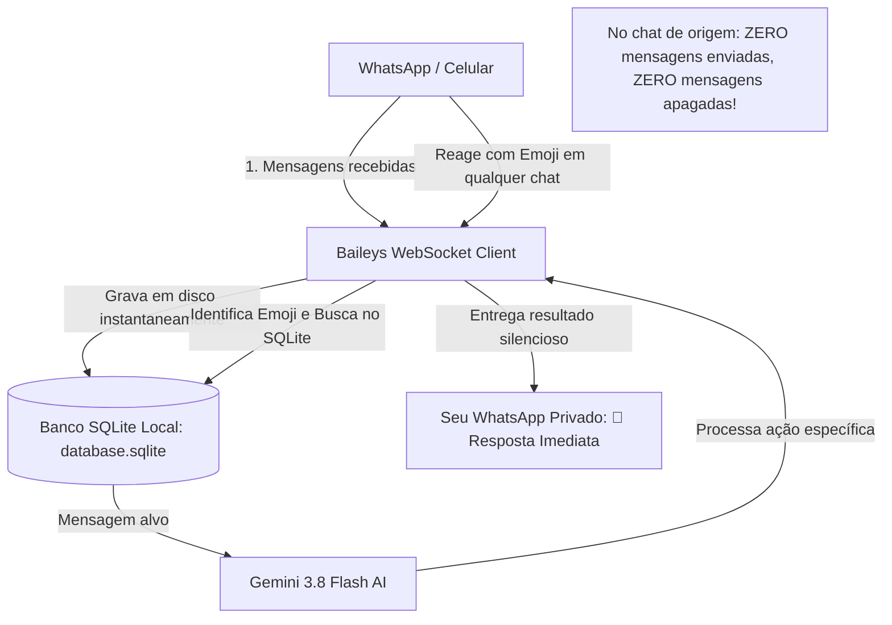

<div align="center">

# 🤖 WhatsApp AI Summarizer + SQLite

**Monitoramento inteligente de grupos e conversas do WhatsApp com Google Gemini 3.8 Flash, banco de dados SQLite local e uma Suíte Completa de Superpoderes Invisíveis acionados por Reações de Emoji.**


</div>

---

## 📌 Visão Geral do Projeto

Em grupos movimentados de trabalho, estudos ou condomínio, dezenas de mensagens e áudios chegam a cada hora. O **WhatsApp AI Summarizer** resolve essa sobrecarga de informação conectando diretamente ao WhatsApp e unindo:

1. **Persistência em Banco SQLite Local:** Todas as mensagens são salvas em disco de forma contínua e rápida (com índices e modo WAL), permitindo consultas históricas mesmo após reiniciar o computador.
2. **IA Multimodal e Estruturada (Gemini 3.8 Flash):** Geração de resumos executivos com JSON Schema estrito, respostas pontuais sobre o histórico da conversa e transcrição de áudios sem precisar escutá-los.
3. **🤫 Central de Superpoderes Invisíveis (Reações por Emoji):** Você não precisa digitar uma única letra no grupo! Apenas reaja com um emoji na mensagem e o resultado cai **exclusivamente no seu WhatsApp privado**.
4. **Segurança e Privacidade:** O banco de dados e as credenciais ficam 100% locais no computador do usuário, protegidos por `.gitignore`.

---

## 🎛️ A Suíte de Superpoderes Invisíveis (Reações por Emoji)

Basta reagir a qualquer mensagem em qualquer chat com um dos emojis abaixo:

| Emoji | Superpoder | O que a IA faz silenciosamente: | Destino |
| :---: | :--- | :--- | :---: |
| **🧠** | **Resumo Geral do Chat** | Lê as últimas 50 mensagens da conversa e entrega um resumo executivo com tópicos, decisões e urgência. | 👻 Privado |
| **✍️** | **Ghostwriter de Respostas** | Analisa a mensagem e gera 3 opções elegantes de resposta pronta (Profissional, Amigável ou Direta). | 👻 Privado |
| **💡** | **Explicador Didático** | Explica termos difíceis, mensagens confusas ou assuntos complexos em linguagem simples. | 👻 Privado |
| **📌** | **Marcador / Fixador** | Salva a mensagem no seu banco de dados SQLite pessoal como favorito (consulte com `!notas`). | 🗄️ SQLite + Privado |
| **🌐** | **Tradutor Instantâneo** | Traduz a mensagem para Português do Brasil com máxima naturalidade. | 👻 Privado |
| **🎯** | **Extrator de Tarefas** | Transforma textões de alinhamento em um checklist de afazeres com prazos e responsáveis. | 👻 Privado |
| **🕵️‍♂️** | **Checador de Fake News** | Analisa a credibilidade do texto, identificando indícios de boatos, golpes ou correntes falsas. | 👻 Privado |
| **💰** | **Divisor de Contas / Rachid** | Calcula a divisão matemática exata dos gastos e o valor que cada um deve pagar no Pix. | 👻 Privado |
| **🔗** | **Resumidor de Links** | Extrai os pontos principais de um link ou matéria de jornal sem precisar abrir a página. | 👻 Privado |
| **🎧** | **Ouvinte de Áudios** | Transcreve e resume mensagens de áudio sem precisar escutá-las. | 👻 Privado |

---

## 🏗️ Arquitetura do Sistema



---

## 🎮 Comandos de Texto Disponíveis

| Comando | O que faz | Onde a resposta aparece |
| :--- | :--- | :--- |
| `!emojis` ou `!superpoderes` | **Manual completo:** Exibe a lista de todos os emojis e suas funções | No chat atual |
| `!notas` | **Caderno de Notas:** Lista todas as mensagens que você fixou com 📌 | No chat atual |
| `!resumo [n]` | Resume as últimas mensagens da conversa | No próprio chat |
| `!resumo pv [n]` | 👻 Resume a conversa e manda no seu privado | **Somente no seu PRIVADO** |
| `!pergunta [pv] <dúvida>` | Faz uma pergunta pontual sobre o histórico | No chat ou privado |
| `!buscar [pv] <palavra>` | Pesquisa mensagens antigas no banco SQLite | No chat ou privado |
| `!historico [pv]` | Exibe o último resumo gerado sem gastar cota de IA | No chat ou privado |
| `!ouvir [pv]` | Transcreve e resume o áudio citado | No chat ou privado |
| `!limpar` | Apaga o histórico do banco de dados desta conversa | Local |
| `!ajuda` | Exibe o menu com os principais comandos | No chat atual |

---

## 🛠️ Tecnologias e Conceitos de Engenharia Aplicados

| Tecnologia / Conceito | Onde e Como foi Usado |
| :--- | :--- |
| **Node.js & TypeScript** | Tipagem estrita com `NodeNext`, garantindo robustez e autocompletion em todo o fluxo de dados. |
| **Gatilhos por Reações de Mensagem (Reactions)** | Escuta de eventos `reactionMessage` para acionamento invisível de fluxos de IA. |
| **SQLite (better-sqlite3)** | Banco de dados relacional embarcado em arquivo local com modo WAL e índices compostos. |
| **IA Multimodal (Áudio + Texto)** | Envio de buffers de áudio em Base64 diretamente para o Gemini 3.8 Flash para transcrição instantânea. |
| **Structured Output & Prompts Especializados** | Schemas estritos para resumos, ghostwriting, fact-checking, extração de tarefas e divisão de contas. |
| **DevSecOps Hygiene** | Chaves `.env`, credenciais `auth_info/` e banco `database.sqlite` protegidos por `.gitignore`. |

---

## 🚀 Como Executar Localmente

### Pré-requisitos
* Node.js 18+ instalado
* Chave gratuita da API do Gemini (obtenha em [Google AI Studio](https://aistudio.google.com/))

### 1. Clonar o repositório
```bash
git clone https://github.com/Cassi-dev/wpp-ai-summarizer.git
cd wpp-ai-summarizer
```

### 2. Instalar dependências
```bash
npm install
```

### 3. Configurar variáveis de ambiente
Crie um arquivo `.env` na raiz (baseado no `.env.example`):
```env
GEMINI_API_KEY=sua_chave_do_gemini_aqui
COMMAND_PREFIX=!
ONLY_OWNER=true
ALWAYS_PRIVATE=false
```

### 4. Iniciar o bot
```bash
npm run dev
```

---

## 📄 Licença
Distribuído sob a licença MIT. Veja `LICENSE` para mais detalhes.

---
<div align="center">
Desenvolvido por <b>Cassiano</b> como parte do seu portfólio de engenharia de software e IA aplicada.
</div>
