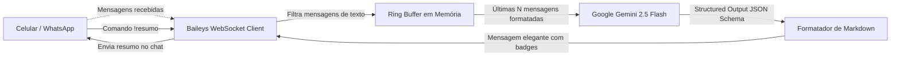

<div align="center">

# 🤖 WhatsApp AI Summarizer

**Monitoramento inteligente de grupos e conversas do WhatsApp com resumos estruturados via Google Gemini AI.**


</div>

---

## 📌 Visão Geral do Projeto

Em grupos movimentados de trabalho, estudos ou condomínio, dezenas de mensagens chegam a cada hora. O **WhatsApp AI Summarizer** resolve essa sobrecarga de informação conectando diretamente ao WhatsApp e gerando **resumos executivos imediatos** sob demanda com a API do Gemini.

O diferencial deste projeto não é apenas "gerar texto livre", mas utilizar **Structured Output (JSON Schema)** para classificar assuntos, identificar decisões, listar pendências e avaliar o grau de urgência das conversas.

---

## 🏗️ Arquitetura do Sistema



---

## ✨ Funcionalidades Principais

* **Conexão Direta via QR Code:** Autenticação rápida no terminal via protocolo WebSocket do WhatsApp Web (usando `@whiskeysockets/baileys`).
* **Persistência de Sessão Segura:** As chaves de autenticação são mantidas localmente na pasta `auth_info/` (devidamente ignoradas no `.gitignore`).
* **IA com Structured Output:** Utiliza o SDK oficial `@google/genai` com schemas estritos (`responseSchema`), garantindo que o retorno venha sempre com:
  - 📝 *Visão Geral*
  - 📌 *Lista de Assuntos*
  - ✅ *Decisões Tomadas*
  - ⚠️ *Pendências / Ações*
  - 🔴/🟡/🟢 *Nível de Urgência (Enum)*
* **Ring Buffer em Memória:** Armazena apenas as últimas 100 mensagens por conversa para evitar consumo excessivo de memória RAM.
* **Comandos Simples:**
  - `!resumo`: Resume as últimas 50 mensagens da conversa.
  - `!resumo 20`: Define uma quantidade customizada de mensagens.
  - `!limpar`: Esvazia a memória temporária do chat.
  - `!ajuda`: Lista todos os comandos disponíveis.

---

## 🛠️ Tecnologias e Conceitos de Engenharia Aplicados

| Tecnologia / Conceito | Onde e Como foi Usado |
| :--- | :--- |
| **Node.js & TypeScript** | Tipagem estrita com `NodeNext`, garantindo robustez e autocompletion em todo o fluxo de dados. |
| **Event-Driven Architecture** | Escuta reativa de eventos assíncronos (`messages.upsert`, `connection.update`) em vez de polling repetitivo. |
| **Ring Buffer (Fila Circular)** | Estrutura de dados em memória para descarte automático de mensagens antigas (`FIFO`). |
| **Structured Output (LLM)** | Elimina a imprevisibilidade de texto livre através de contratos de dados em JSON Schema. |
| **DevSecOps Hygiene** | Proteção contra vazamento de credenciais e tokens através de variáveis de ambiente (`.env`) e `.gitignore` rigoroso. |

---

## 🚀 Como Executar Localmente

### Pré-requisitos
* Node.js 18+ instalado
* Chave gratuita da API do Gemini (obtenha em [Google AI Studio](https://aistudio.google.com/))

### 1. Clonar o repositório
```bash
git clone https://github.com/Cassi-dev/wpp-ai-summarizer.git
cd wpp-ai-summarizer
```

### 2. Instalar dependências
```bash
npm install
```

### 3. Configurar variáveis de ambiente
Crie um arquivo `.env` na raiz (baseado no `.env.example`):
```env
GEMINI_API_KEY=sua_chave_do_gemini_aqui
COMMAND_PREFIX=!
```

### 4. Iniciar o bot
```bash
npm run dev
```

### 5. Conectar
1. O terminal exibirá um **QR Code**.
2. Abra o WhatsApp no celular ➔ toque nos **3 pontos** (ou Configurações) ➔ **Aparelhos Conectados** ➔ **Conectar um aparelho**.
3. Escaneie o QR Code e pronto! O bot começará a monitorar e responder a `!resumo`.

---

## 📄 Licença
Distribuído sob a licença MIT. Veja `LICENSE` para mais detalhes.

---
<div align="center">
Desenvolvido por <b>Cassiano</b> como parte do seu portfólio de engenharia de software e IA aplicada.
</div>
