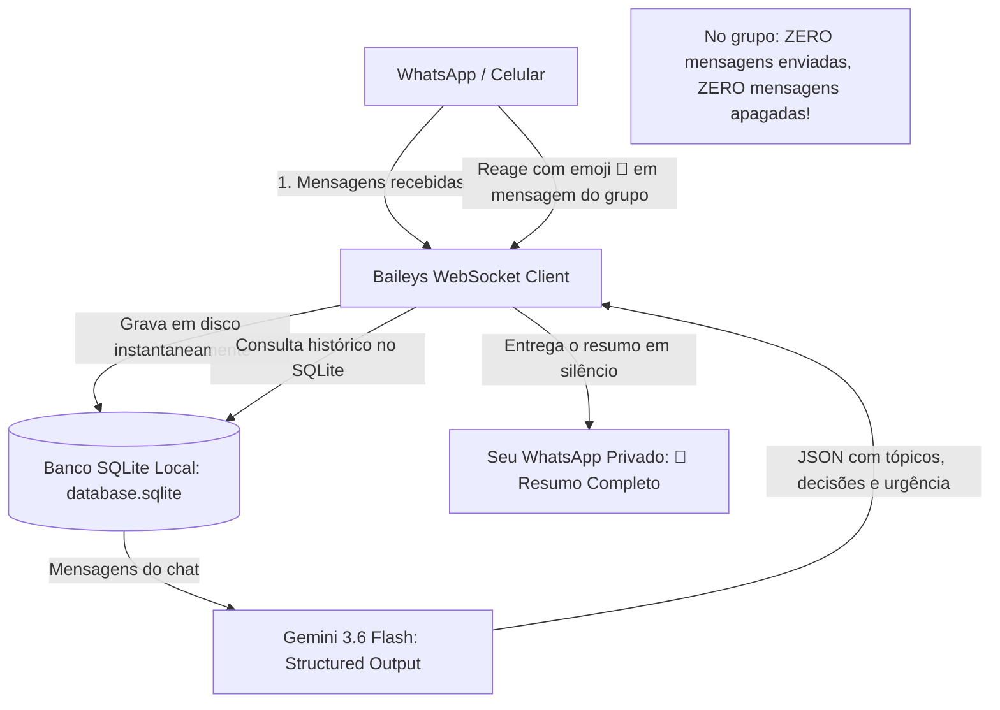

<div align="center">

# 🤖 WhatsApp AI Summarizer + SQLite

**Monitoramento inteligente de grupos e conversas do WhatsApp com resumos estruturados via Google Gemini AI, persistência local com SQLite e Gatilho Invisível por Reação de Emoji (🧠).**


</div>

---

## 📌 Visão Geral do Projeto

Em grupos movimentados de trabalho, estudos ou condomínio, dezenas de mensagens e áudios chegam a cada hora. O **WhatsApp AI Summarizer** resolve essa sobrecarga de informação conectando diretamente ao WhatsApp e unindo:

1. **Persistência em Banco SQLite Local:** Todas as mensagens são salvas em disco de forma contínua e rápida (com índices e modo WAL), permitindo consultas históricas mesmo após reiniciar o computador.
2. **IA Multimodal e Estruturada (Gemini 3.6 Flash):** Geração de resumos executivos com JSON Schema estrito, respostas pontuais sobre o histórico da conversa e transcrição de áudios sem precisar escutá-los.
3. **🧠 Gatilho Invisível (Modo Fantasma por Reação):** Reaja com o emoji 🧠 a qualquer mensagem de qualquer chat para receber o resumo no seu privado com zero mensagens no grupo e sem deixar rastros!
4. **Segurança e Privacidade:** O banco de dados e as credenciais ficam 100% locais no computador do usuário, protegidos por `.gitignore`.

---

## 🏗️ Arquitetura do Sistema



---

## ✨ Funcionalidades Principais

* **🧠 Gatilho Invisível por Emoji (Reação):** Reaja com 🧠 a qualquer mensagem e o resumo daquele chat é entregue na sua conversa com você mesmo. Ninguém no grupo vê absolutamente nada!
* **👻 Modo Fantasma por Comando (`!resumo pv` ou `!pergunta pv`):** Desvia a resposta do robô para o seu chat privado pessoal sem avisos nem mensagens apagadas.
* **🗄️ Banco de Dados SQLite Local:** Armazena todas as mensagens com índices de alta performance e modo WAL.
* **🔍 Pesquisa Histórica (`!buscar [pv] <palavra>`):** Encontra mensagens antigas no banco SQLite com data e autor original.
* **🎧 Transcrição e Resumo de Áudio (`!ouvir [pv]`):** Responda a qualquer áudio com `!ouvir` para o robô transcrever o conteúdo e resumir os pontos principais via Gemini multimodal.
* **❓ Consultas Contextuais (`!pergunta [pv] <dúvida>`):** Pergunte qualquer coisa sobre o histórico recente (ex: *"Qual o preço combinado?"*) e a IA responde com precisão.
* **📋 Resumos Estruturados com Schema (`!resumo`):** Retorna visão geral, tópicos debatidos, decisões tomadas, pendências e badge de urgência.
* **🔒 Trava de Segurança Antispam (`ONLY_OWNER`):** Apenas você tem permissão para acionar comandos.

---

## 🛠️ Tecnologias e Conceitos de Engenharia Aplicados

| Tecnologia / Conceito | Onde e Como foi Usado |
| :--- | :--- |
| **Node.js & TypeScript** | Tipagem estrita com `NodeNext`, garantindo robustez e autocompletion em todo o fluxo de dados. |
| **Gatilhos por Reações de Mensagem (Reactions)** | Escuta de eventos `reactionMessage` para acionamento invisível de fluxos de IA. |
| **SQLite (better-sqlite3)** | Banco de dados relacional embarcado em arquivo local com modo WAL e índices compostos. |
| **IA Multimodal (Áudio + Texto)** | Envio de buffers de áudio em Base64 diretamente para o Gemini 3.6 Flash para transcrição instantânea. |
| **Event-Driven Architecture** | Escuta reativa de eventos assíncronos (`messages.upsert`, `connection.update`) em vez de polling repetitivo. |
| **Structured Output (LLM)** | Elimina a imprevisibilidade de texto livre através de contratos de dados em JSON Schema. |
| **DevSecOps Hygiene** | Chaves `.env`, credenciais `auth_info/` e banco `database.sqlite` protegidos por `.gitignore`. |

---

## 🚀 Como Executar Localmente

### Pré-requisitos
* Node.js 18+ instalado
* Chave gratuita da API do Gemini (obtenha em [Google AI Studio](https://aistudio.google.com/))

### 1. Clonar o repositório
```bash
git clone https://github.com/Cassi-dev/wpp-ai-summarizer.git
cd wpp-ai-summarizer
```

### 2. Instalar dependências
```bash
npm install
```

### 3. Configurar variáveis de ambiente
Crie um arquivo `.env` na raiz (baseado no `.env.example`):
```env
GEMINI_API_KEY=sua_chave_do_gemini_aqui
COMMAND_PREFIX=!
ONLY_OWNER=true
ALWAYS_PRIVATE=false
```

### 4. Iniciar o bot
```bash
npm run dev
```

---

## 🎮 Formas de Usar no WhatsApp

| Ação | O que acontece | Onde a resposta aparece |
| :--- | :--- | :--- |
| **Reagir com 🧠 em qualquer mensagem** | 🧠 **Gatilho Invisível:** Resume a conversa discretamente | **Somente no seu PRIVADO** |
| `!resumo [n]` | Resume as últimas mensagens da conversa | No próprio chat/grupo |
| `!resumo pv [n]` | 👻 Resume a conversa e manda no seu privado | **Somente no seu PRIVADO** |
| `!pergunta pv <dúvida>` | 👻 Responde sua dúvida no seu privado | **Somente no seu PRIVADO** |
| `!buscar [pv] <palavra>` | Pesquisa mensagens antigas no banco SQLite | No chat ou privado |
| `!ouvir [pv]` | Transcreve e resume o áudio citado | No chat ou privado |
| `!ajuda` | Exibe o menu com todos os comandos | No chat atual |

---

## 📄 Licença
Distribuído sob a licença MIT. Veja `LICENSE` para mais detalhes.

---
<div align="center">
Desenvolvido por <b>Cassiano</b> como parte do seu portfólio de engenharia de software e IA aplicada.
</div>
