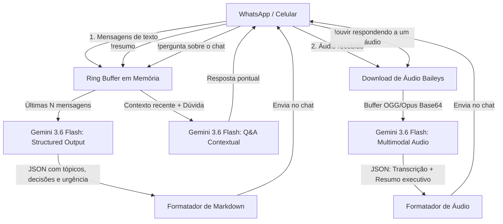

<div align="center">

# 🤖 WhatsApp AI Summarizer

**Monitoramento inteligente de grupos e conversas do WhatsApp com resumos estruturados, transcrição de áudios e respostas a dúvidas via Google Gemini AI.**


</div>

---

## 📌 Visão Geral do Projeto

Em grupos movimentados de trabalho, estudos ou condomínio, dezenas de mensagens e áudios chegam a cada hora. O **WhatsApp AI Summarizer** resolve essa sobrecarga de informação conectando diretamente ao WhatsApp e gerando **resumos executivos imediatos**, **transcrição de áudios sem precisar ouvi-los** e **respostas para perguntas pontuais sobre o histórico da conversa** via API do Google Gemini.

O diferencial deste projeto não é apenas "gerar texto livre", mas utilizar **Structured Output (JSON Schema)** e capacidades **Multimodais nativas de áudio** para organizar a comunicação em tempo real.

---

## 🏗️ Arquitetura do Sistema



---

## ✨ Funcionalidades Principais

* **🎧 Transcrição e Resumo de Áudio (`!ouvir`):** Responda a qualquer áudio do WhatsApp com `!ouvir` para o robô baixar a mídia, processar com IA multimodal e devolver o texto transcrito + os pontos principais.
* **🔍 Perguntas sobre a Conversa (`!pergunta <dúvida>`):** Pergunte qualquer coisa sobre o histórico recente (ex: *"Qual o preço combinado?"*, *"Quem vai levar o documento?"*) e a IA responde direto ao ponto.
* **📋 Resumo Estruturado com JSON Schema (`!resumo`):** Retorna visão geral, tópicos debatidos, decisões tomadas, pendências e um badge de urgência (🟢 Baixa / 🟡 Média / 🔴 Alta).
* **🔒 Trava de Segurança Antispam:** Por padrão, apenas você (o dono da conta do WhatsApp) pode acionar comandos nos grupos. Suporta adicionar números permitidos no `.env`.
* **⚡ Conexão WebSocket Direta:** Sem emuladores pesados de navegador; conexão leve e instantânea via protocolo Baileys.
* **💾 Ring Buffer em Memória:** Mantém apenas as mensagens mais recentes por chat, evitando consumo desnecessário de memória RAM.

---

## 🛠️ Tecnologias e Conceitos de Engenharia Aplicados

| Tecnologia / Conceito | Onde e Como foi Usado |
| :--- | :--- |
| **Node.js & TypeScript** | Tipagem estrita com `NodeNext`, garantindo robustez e autocompletion em todo o fluxo de dados. |
| **IA Multimodal (Áudio + Texto)** | Envio de buffers de áudio em Base64 diretamente para o Gemini 3.6 Flash para transcrição instantânea. |
| **Event-Driven Architecture** | Escuta reativa de eventos assíncronos (`messages.upsert`, `connection.update`) em vez de polling repetitivo. |
| **Structured Output (LLM)** | Elimina a imprevisibilidade de texto livre através de contratos de dados em JSON Schema. |
| **Ring Buffer (Fila Circular)** | Estrutura de dados em memória para descarte automático de mensagens antigas (`FIFO`). |
| **DevSecOps Hygiene** | Proteção contra vazamento de credenciais e tokens através de variáveis de ambiente (`.env`) e `.gitignore` rigoroso. |

---

## 🚀 Como Executar Localmente

### Pré-requisitos
* Node.js 18+ instalado
* Chave gratuita da API do Gemini (obtenha em [Google AI Studio](https://aistudio.google.com/))

### 1. Clonar o repositório
```bash
git clone https://github.com/Cassi-dev/wpp-ai-summarizer.git
cd wpp-ai-summarizer
```

### 2. Instalar dependências
```bash
npm install
```

### 3. Configurar variáveis de ambiente
Crie um arquivo `.env` na raiz (baseado no `.env.example`):
```env
GEMINI_API_KEY=sua_chave_do_gemini_aqui
COMMAND_PREFIX=!
ONLY_OWNER=true
```

### 4. Iniciar o bot
```bash
npm run dev
```

### 5. Conectar
1. O terminal exibirá um **QR Code**.
2. Abra o WhatsApp no celular ➔ toque nos **3 pontos** (ou Configurações) ➔ **Aparelhos Conectados** ➔ **Conectar um aparelho**.
3. Escaneie o QR Code e pronto!

---

## 🎮 Lista de Comandos no WhatsApp

| Comando | O que faz | Exemplo |
| :--- | :--- | :--- |
| `!resumo [n]` | Resume as conversas recentes daquele chat | `!resumo` ou `!resumo 30` |
| `!pergunta <dúvida>` | Pergunta pontual sobre o que conversaram | `!pergunta Qual o horário marcado?` |
| `!ouvir` | Responda a um áudio com este comando para transcrever e resumir | Responda ao áudio com `!ouvir` |
| `!limpar` | Esvazia o buffer de mensagens recentes daquela conversa | `!limpar` |
| `!ajuda` | Exibe o menu com todos os comandos disponíveis | `!ajuda` |

---

## 📄 Licença
Distribuído sob a licença MIT. Veja `LICENSE` para mais detalhes.

---
<div align="center">
Desenvolvido por <b>Cassiano</b> como parte do seu portfólio de engenharia de software e IA aplicada.
</div>
