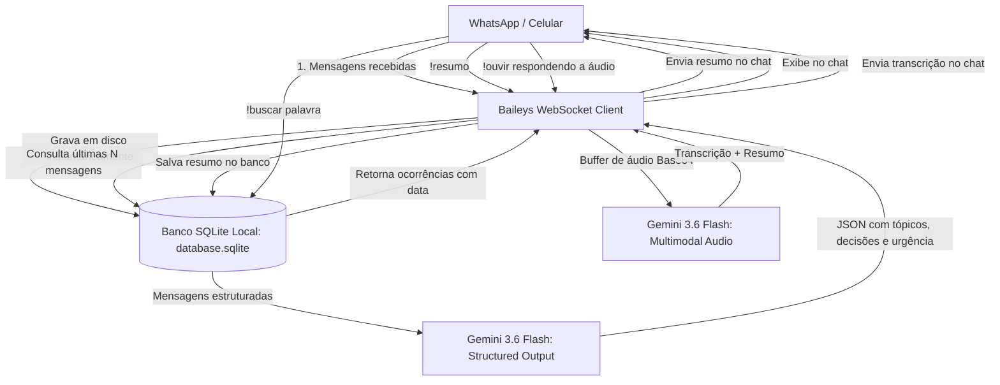

<div align="center">

# 🤖 WhatsApp AI Summarizer + SQLite

**Monitoramento inteligente de grupos e conversas do WhatsApp com resumos estruturados via Google Gemini AI e persistência local com SQLite.**


</div>

---

## 📌 Visão Geral do Projeto

Em grupos movimentados de trabalho, estudos ou condomínio, dezenas de mensagens e áudios chegam a cada hora. O **WhatsApp AI Summarizer** resolve essa sobrecarga de informação conectando diretamente ao WhatsApp e unindo:

1. **Persistência em Banco SQLite Local:** Todas as mensagens são salvas em disco de forma contínua e rápida (com índices e modo WAL), permitindo consultas históricas mesmo após reiniciar o computador.
2. **IA Multimodal e Estruturada (Gemini 3.6 Flash):** Geração de resumos executivos com JSON Schema estrito, respostas pontuais sobre o histórico da conversa e transcrição de áudios sem precisar escutá-los.
3. **Segurança e Privacidade:** O banco de dados e as credenciais ficam 100% locais no computador do usuário, protegidos por `.gitignore`.

---

## 🏗️ Arquitetura do Sistema



---

## ✨ Funcionalidades Principais

* **🗄️ Banco de Dados SQLite Local:** 
  - Armazena todas as mensagens com índices de alta performance (`remote_jid` + `timestamp`).
  - Habilita o modo **WAL (Write-Ahead Logging)** para velocidade de leitura/escrita simultânea.
  - Guarda os resumos já gerados para consulta instantânea com `!historico` (sem gastar cota da IA).
* **🔍 Pesquisa Histórica (`!buscar <palavra>`):** Encontra mensagens antigas no banco SQLite com data e autor original.
* **🎧 Transcrição e Resumo de Áudio (`!ouvir`):** Responda a qualquer áudio com `!ouvir` para o robô transcrever o conteúdo e resumir os pontos principais via Gemini multimodal.
* **❓ Consultas Contextuais (`!pergunta <dúvida>`):** Pergunte qualquer coisa sobre o histórico recente (ex: *"Qual o preço combinado?"*) e a IA responde com precisão.
* **📋 Resumos Estruturados com Schema (`!resumo`):** Retorna visão geral, tópicos debatidos, decisões tomadas, pendências e badge de urgência (🟢 Baixa / 🟡 Média / 🔴 Alta).
* **🔒 Trava de Segurança Antispam (`ONLY_OWNER`):** Apenas você tem permissão para acionar comandos, evitando consumo abusivo de IA por terceiros.

---

## 🛠️ Tecnologias e Conceitos de Engenharia Aplicados

| Tecnologia / Conceito | Onde e Como foi Usado |
| :--- | :--- |
| **Node.js & TypeScript** | Tipagem estrita com `NodeNext`, garantindo robustez e autocompletion em todo o fluxo de dados. |
| **SQLite (better-sqlite3)** | Banco de dados relacional embarcado em arquivo local com modo WAL e índices compostos. |
| **IA Multimodal (Áudio + Texto)** | Envio de buffers de áudio em Base64 diretamente para o Gemini 3.6 Flash para transcrição instantânea. |
| **Event-Driven Architecture** | Escuta reativa de eventos assíncronos (`messages.upsert`, `connection.update`) em vez de polling repetitivo. |
| **Structured Output (LLM)** | Elimina a imprevisibilidade de texto livre através de contratos de dados em JSON Schema. |
| **DevSecOps Hygiene** | Chaves `.env`, credenciais `auth_info/` e banco `database.sqlite` protegidos por `.gitignore`. |

---

## 🚀 Como Executar Localmente

### Pré-requisitos
* Node.js 18+ instalado
* Chave gratuita da API do Gemini (obtenha em [Google AI Studio](https://aistudio.google.com/))

### 1. Clonar o repositório
```bash
git clone https://github.com/Cassi-dev/wpp-ai-summarizer.git
cd wpp-ai-summarizer
```

### 2. Instalar dependências
```bash
npm install
```

### 3. Configurar variáveis de ambiente
Crie um arquivo `.env` na raiz (baseado no `.env.example`):
```env
GEMINI_API_KEY=sua_chave_do_gemini_aqui
COMMAND_PREFIX=!
ONLY_OWNER=true
```

### 4. Iniciar o bot
```bash
npm run dev
```

### 5. Conectar
1. O terminal exibirá um **QR Code**.
2. Abra o WhatsApp no celular ➔ toque nos **3 pontos** (ou Configurações) ➔ **Aparelhos Conectados** ➔ **Conectar um aparelho**.
3. Escaneie o QR Code e pronto! O arquivo `database.sqlite` será criado automaticamente para arquivar suas mensagens.

---

## 🎮 Lista Completa de Comandos

| Comando | O que faz | Exemplo |
| :--- | :--- | :--- |
| `!resumo [n]` | Resume as últimas mensagens da conversa salvas no SQLite | `!resumo` ou `!resumo 100` |
| `!pergunta <dúvida>` | Pergunta pontual sobre o histórico da conversa com IA | `!pergunta Qual o horário da entrega?` |
| `!buscar <palavra>` | Pesquisa mensagens antigas arquivadas no banco SQLite | `!buscar orçamento` |
| `!historico` | Exibe o último resumo gerado sem gastar cota de IA | `!historico` |
| `!ouvir` | Responda a um áudio com este comando para transcrever | Responda ao áudio com `!ouvir` |
| `!limpar` | Apaga o histórico do banco de dados desta conversa | `!limpar` |
| `!ajuda` | Exibe o menu com todos os comandos disponíveis | `!ajuda` |

---

## 📄 Licença
Distribuído sob a licença MIT. Veja `LICENSE` para mais detalhes.

---
<div align="center">
Desenvolvido por <b>Cassiano</b> como parte do seu portfólio de engenharia de software e IA aplicada.
</div>
